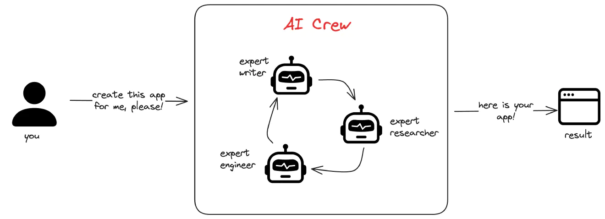

# AI-CREW for Dualboot Partners

## Table of Contents
1. [Introduction](#introduction)
2. [What is CrewAI?](#what-is-crew-ai)
3. [The Problem](#the-problem)
4. [Our Solution](#our-solution)
5. [Agents Setup](#agents-setup)
6. [Tasks Setup](#tasks-setup)
7. [Running the Code](#running-the-code)
8. [Contributing](#contributing)

## Introduction
In this project, we will leverage **CrewAI**, an advanced tool that allows us to create autonomous agents tailored to assist the sales team at Dualboot Partners. These agents will streamline various tasks such as research, industry trend analysis, and identifying potential sales opportunities. **CrewAI** enables us to assemble a team of specialized agents, each focusing on specific aspects of our sales strategy, ensuring efficiency and precision in our business processes.

## What is CrewAI?
**CrewAI** is a platform that allows us to create our own teams of autonomous agents, each dedicated to a specific task. These agents work together to achieve a common goal, such as generating reports, conducting market research, or even building applications. By defining the roles and tasks for each agent, we can automate complex workflows, allowing the team to focus on more strategic tasks.

Each agent is an expert in a different task, and they all work together to help us achieve our goal. This goal can be either crafting an email based on some research, creating a business plan, writing a book, creating a blog post, etc.

The possibilities are infinite.

All we have to do is think of the process and tasks that would be required to achieve our goal, and assign those tasks to our crew of agents. They will do all the work for us.



In this project, our goal is to set up a Crew AI to assist the sales team at Dualboot Partners by providing a detailed report containing relevant information about the industry, potential sales opportunities, and strategic recommendations for future actions.

To configure this Crew AI, we should consider the following concepts: tasks, agents, tools, and processes.

1. **Tasks**: These are the specific actions our agents will perform. Each task will be assigned to an agent.
2. **Agents**: These are the AI agents working for us, each specialized in a specific task. In our case, we will have 4 agents.
3. **Tools**: These are the resources that our agents will use to complete their tasks. Examples include search engines, data analysis tools, or text processing software.
4. **Process**: A process dictates how our agents will work together. In this case, we will use a sequential process, meaning each agent will perform its task one after the other.

## How to Plan Your Crew
The diagram above clearly shows that the main axis when assembling our crew is the list of tasks our crew will perform. Think of it as a to-do list.

In this case, the main tasks are:

1. Research potential companies in the U.S.
2. Analyze software industry trends.
3. Prepare a report with sales opportunities.
4. Summarize strategic recommendations.

## Tasks
Let’s delve a little deeper into the **Task** object. In CrewAI, each **Task** has the following properties:

- **Description**: For example, "Search the web for relevant information about potential clients in the U.S." Try to make it as detailed as possible. This will be part of the prompt that the agent will use to perform the task.
- **Agent**: The agent that will perform this task.
- **Context**: Other information needed to perform the task. Usually, this is the output from the previous tasks.
- **Async Execution**: Whether or not the task should be executed simultaneously with other tasks. In our example, the first two tasks (Research potential companies and Analyze industry) can be executed simultaneously, while the last two tasks (Prepare report and Summarize recommendations) should not. This is because the last two tasks depend on the output of the first two.

## The Problem
The sales team at Dualboot Partners needs to efficiently identify and engage potential clients in a highly competitive market. This requires not only finding leads but also analyzing industry trends and structuring large volumes of data for quick access and decision-making. The manual process of doing this is time-consuming and prone to errors.

## Our Solution
We propose creating a CrewAI system with four autonomous agents:

1. **RAG Agent (Information Indexer)**: Indexes and organizes information on potential companies in ChromaDB to make it easily searchable.
2. **Opportunity Research Agent**: Identifies companies in the United States that might benefit from Dualboot Partners' software development services.
3. **Industry Analyst Agent**: Analyzes market trends and provides strategic insights to guide the sales team.
4. **Writer Agent**: Compiles the findings from the other agents and generates a comprehensive report detailing potential sales opportunities and industry insights.

## Agents Setup
1. **RAG Agent**
    - **Role**: Information Indexer
    - **Goal**: Index information in ChromaDB for efficient retrieval.
    - **Backstory**: An expert in managing and structuring large data volumes, ensuring critical information is easily accessible.

2. **Opportunity Research Agent**
    - **Role**: Opportunity Researcher
    - **Goal**: Find potential leads in the US market interested in software development.
    - **Backstory**: A market analysis expert who identifies opportunities with a blend of detailed analysis and creativity.

3. **Industry Analyst Agent**
    - **Role**: Industry Analyst
    - **Goal**: Provide market trend insights to inform sales strategy.
    - **Backstory**: A strategist who turns industry data into actionable recommendations.

4. **Writer Agent**
    - **Role**: Report Compiler
    - **Goal**: Compile all findings into a coherent and comprehensive report.
    - **Backstory**: A skilled writer who can transform data and analysis into a clear and actionable report.

## Tasks Setup
1. **Indexar Información**
    - **Description**: The RAG Agent indexes all relevant company information into ChromaDB.
    - **Expected Output**: A vector database with structured, accessible information.

2. **Búsqueda de Oportunidades**
    - **Description**: The Opportunity Research Agent identifies US companies that might need Dualboot Partners' services.
    - **Expected Output**: A report listing 10 potential companies, with contact information and software needs.

3. **Análisis de la Industria**
    - **Description**: The Industry Analyst Agent identifies key trends and opportunities in the software market.
    - **Expected Output**: A strategic report for the sales team with insights and recommendations.

4. **Informe Final**
    - **Description**: The Writer Agent compiles findings from all other agents into a comprehensive report.
    - **Expected Output**: A detailed report with sales opportunities, industry insights, and strategic recommendations.

## Running the Code
To run the code in this repository, follow these steps:

1. Clone the repository:
    ```bash
    git clone https://github.com/AlejandroVivasDB/AI-CrewAI.git
    cd AI-CrewAI
    ```

2. Create and activate a virtual environment:
    ```bash
    python -m venv venv
    source venv/Scripts/activate  # On Windows
    # or
    source venv/bin/activate  # On Unix or MacOS
    ```

3. Install the required dependencies:
    ```bash
    pip install -r requirements.txt
    ```

4. Set up environment variables by creating a `.env` file:
    ```bash
    OPENAI_API_KEY=[your-openai-api-key]
    ```

5. Run the application:
    ```bash
    python main.py
    ```

## Contributing
We welcome contributions to this repository. If you have any improvements or suggestions, please create a pull request or open an issue to discuss your ideas.
